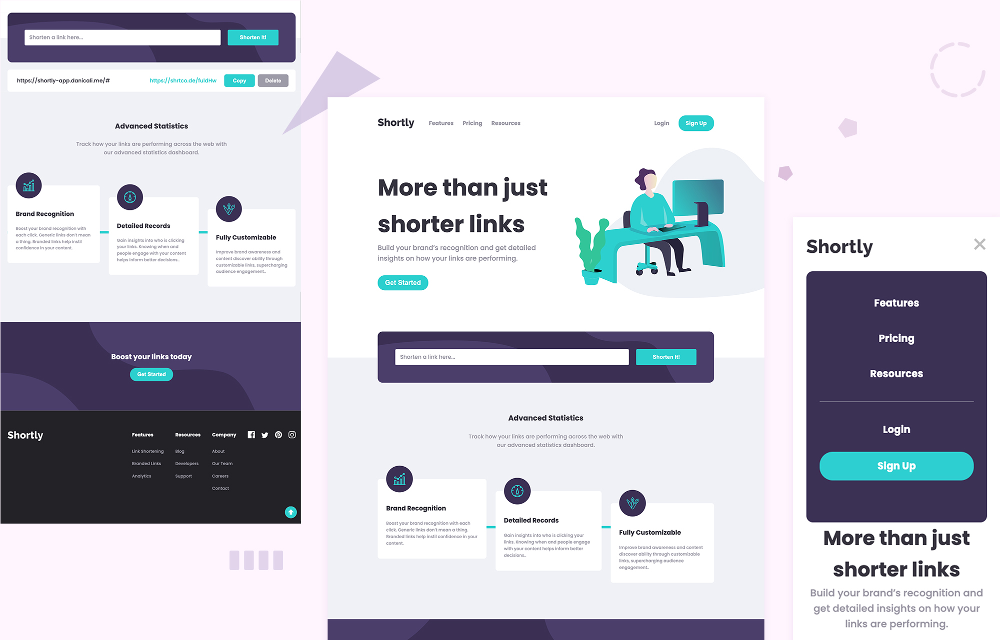

# URL Shortening API Landing Page (Frontend Mentor Challenge)

## **[Live Demo](https://shortly-app.danicali.me/)** 🎉

# Description

Responsive landing page solution for one of challenges for [frontendmentor.io](https://www.frontendmentor.io/challenges/url-shortening-api-landing-page-2ce3ob-G)

# Main Features

- Followed the principle of Mobile First
- Responsive layouts depending on device's screen size
- Used **React** to implement the front-end
- Consumed the **[shrtcode API](https://app.shrtco.de/)** to create shortened URLs
- Used Sass pre-processor to describe the stylesheets cleanly and structurally
- CI/CD integration with **Firebase**
- Stored shortened links in **window.localStorage** with no expiration time
- Made it easy for user to copy/delete the shortened link in a single click
- Animations on dropdown menu of mobile view and loading spinner

# Credits

- Designed by [Frontend Mentor](https://www.frontendmentor.io)
- Coded by [Danica](https://github.com/wandanli)
